```R
library(tidyverse)
library(data.table)

library(gtsummary)
library(IRdisplay)
library(gt)

tbl_summary_show <- function(data, ...) {
    tbl_summary(data, ...) %>%
        add_n() %>%
        as_gt() %>%
        as_raw_html() %>%
        display_html()
}

tbl_regression_show <- function(data, ...) {
    tbl_regression(data, exponentiate = F, intercept = T, ...) %>%
        add_global_p(keep = T) %>%
        bold_p(t = 0.05, q = FALSE) %>%
        as_gt() %>%
        as_raw_html() %>%
        display_html()
}
```

# Question 1

## a


```R
wage <- read.csv("./wage.csv") %>% as.data.table()
head(wage)
```


<table class="dataframe">
<caption>A data.table: 6 × 2</caption>
<thead>
	<tr><th scope=col>wage</th><th scope=col>schooling</th></tr>
	<tr><th scope=col>&lt;dbl&gt;</th><th scope=col>&lt;int&gt;</th></tr>
</thead>
<tbody>
	<tr><td>2.394389</td><td>17</td></tr>
	<tr><td>3.660709</td><td>17</td></tr>
	<tr><td>3.912023</td><td>16</td></tr>
	<tr><td>3.091042</td><td>13</td></tr>
	<tr><td>2.862201</td><td>12</td></tr>
	<tr><td>3.769458</td><td>17</td></tr>
</tbody>
</table>


```R
wage[, .(
    mean_wage = mean(wage),
    sd_wage = sd(wage),
    most_common_edu = which.max(table(schooling))
)]
```


<table class="dataframe">
<caption>A data.table: 1 × 3</caption>
<thead>
	<tr><th scope=col>mean_wage</th><th scope=col>sd_wage</th><th scope=col>most_common_edu</th></tr>
	<tr><th scope=col>&lt;dbl&gt;</th><th scope=col>&lt;dbl&gt;</th><th scope=col>&lt;int&gt;</th></tr>
</thead>
<tbody>
	<tr><td>2.999413</td><td>0.5624846</td><td>11</td></tr>
</tbody>
</table>


### Discussion
Above are the mean and sd of wage and the most common years of education is 11 years. These are the people who only did highschool, as far as I udnerstand from the American school system.

## b


```R
ggplot(data = wage)+
geom_point(mapping = aes(x = schooling, y = wage))+
geom_smooth(mapping = aes(x = schooling, y = wage), method = "lm")+
geom_smooth(mapping = aes(x = schooling, y = wage), method = "loess", color="red")
```

    `geom_smooth()` using formula = 'y ~ x'
    `geom_smooth()` using formula = 'y ~ x'
    Warning message in simpleLoess(y, x, w, span, degree = degree, parametric = parametric, :
    “pseudoinverse used at 14”
    Warning message in simpleLoess(y, x, w, span, degree = degree, parametric = parametric, :
    “neighborhood radius 2”
    Warning message in simpleLoess(y, x, w, span, degree = degree, parametric = parametric, :
    “reciprocal condition number  5.5607e-16”
    Warning message in predLoess(object$y, object$x, newx = if (is.null(newdata)) object$x else if (is.data.frame(newdata)) as.matrix(model.frame(delete.response(terms(object)), :
    “pseudoinverse used at 14”
    Warning message in predLoess(object$y, object$x, newx = if (is.null(newdata)) object$x else if (is.data.frame(newdata)) as.matrix(model.frame(delete.response(terms(object)), :
    “neighborhood radius 2”
    Warning message in predLoess(object$y, object$x, newx = if (is.null(newdata)) object$x else if (is.data.frame(newdata)) as.matrix(model.frame(delete.response(terms(object)), :
    “reciprocal condition number  5.5607e-16”


    
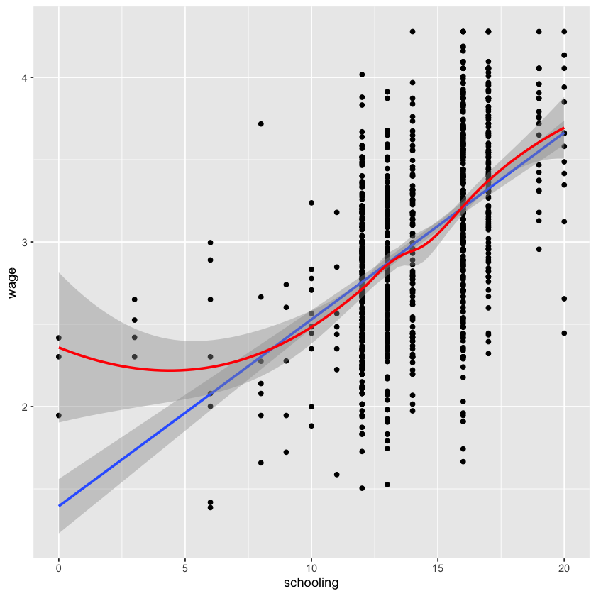
    


### Discussion
Above is a scatter plot with a linear model and and a loess model. As we can see, in participants with schooling more than 8-9 years, we have an approximately linear relationship. However, this relationship is not linear for the people with less schooling. At each level of schooling, especially for people with more than 5 years of schooling, we see similar number of people above and below the line. They are mostly symmetric, meaning that the exogeneity does seem to hold for most participants. Also, The spread of these points above and beyond seems to be similar across different levels of education, signaling homoskedasticity.

## c


```R
cor.test(wage$schooling, wage$wage)
```


    
    	Pearson's product-moment correlation
    
    data:  wage$schooling and wage$wage
    t = 19.388, df = 998, p-value < 2.2e-16
    alternative hypothesis: true correlation is not equal to 0
    95 percent confidence interval:
     0.4765318 0.5666895
    sample estimates:
          cor 
    0.5230724 


```R
cov(wage$schooling, wage$wage)
```


0.762769449253975


```R
lm_wage_schooling <- lm(wage ~ schooling, data = wage)
summary(lm_wage_schooling)
plot(lm_wage_schooling)
```


    
    Call:
    lm(formula = wage ~ schooling, data = wage)
    
    Residuals:
         Min       1Q   Median       3Q      Max 
    -1.54501 -0.32814 -0.00371  0.34759  1.41464 
    
    Coefficients:
                Estimate Std. Error t value Pr(>|t|)    
    (Intercept) 1.394687   0.084146   16.57   <2e-16 ***
    schooling   0.113488   0.005853   19.39   <2e-16 ***
    ---
    Signif. codes:  0 ‘***’ 0.001 ‘**’ 0.01 ‘*’ 0.05 ‘.’ 0.1 ‘ ’ 1
    
    Residual standard error: 0.4796 on 998 degrees of freedom
    Multiple R-squared:  0.2736,	Adjusted R-squared:  0.2729 
    F-statistic: 375.9 on 1 and 998 DF,  p-value: < 2.2e-16


    
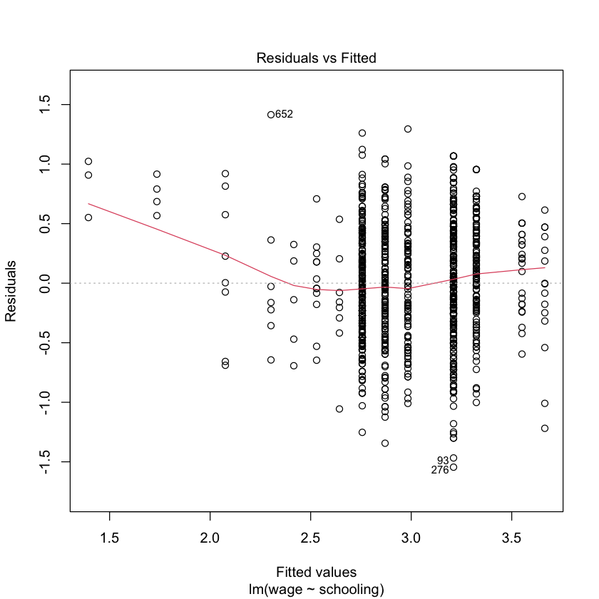
    


    

    


    
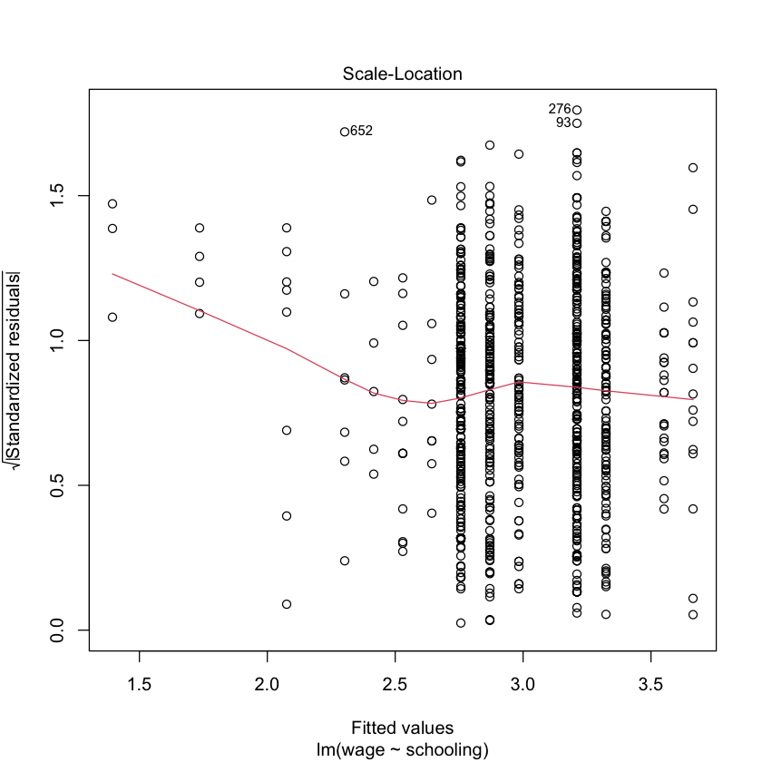
    


    
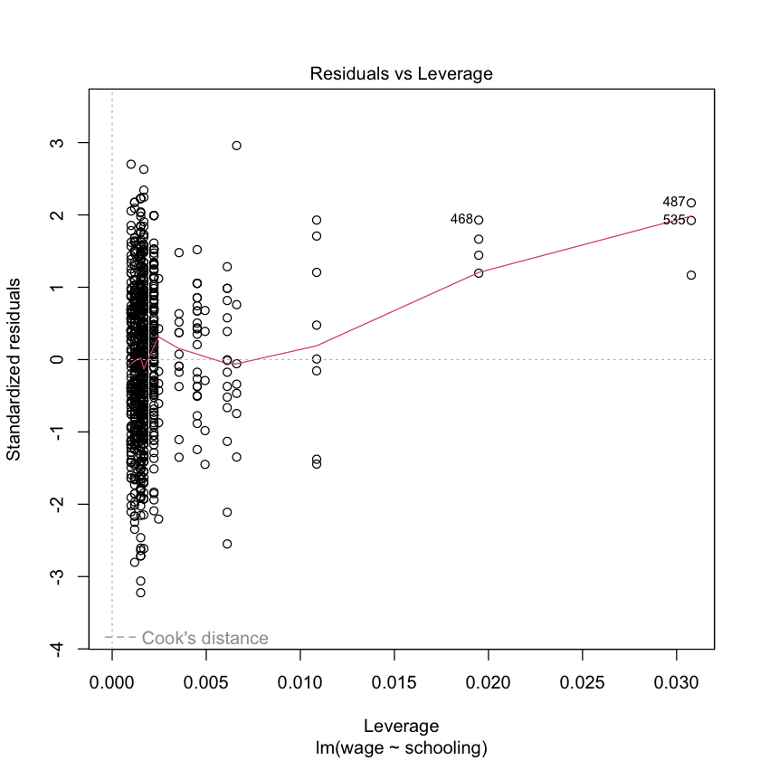
    


### Discussion
The correlation is 0.52 and the covariance is 0.76. The slope of schooling on age is 0.11. The diagnostic plots show similar results to what I said in the last part, with people with lower wage (and lower education) having a somewhat non-linear relationship, but this relationshop becomming mostly linear and homoskedastic when the fitted wage values are above 2. The residuals resemble a normal distribution in the QQ plot. 

## d


```R
var(wage[,wage10])
var(wage[,wage])
```


31.6388883798708


0.316388883798708


```R
wage[, wage10 := wage * 10]

cov(wage$schooling, wage$wage10)
cor.test(wage$schooling, wage$wage10)
```


7.62769449253973


    
    	Pearson's product-moment correlation
    
    data:  wage$schooling and wage$wage10
    t = 19.388, df = 998, p-value < 2.2e-16
    alternative hypothesis: true correlation is not equal to 0
    95 percent confidence interval:
     0.4765318 0.5666895
    sample estimates:
          cor 
    0.5230724 


```R
lm_wage10_schooling <- lm(wage10 ~ schooling, data = wage)
summary(lm_wage10_schooling)
```


    
    Call:
    lm(formula = wage10 ~ schooling, data = wage)
    
    Residuals:
         Min       1Q   Median       3Q      Max 
    -15.4501  -3.2814  -0.0371   3.4759  14.1464 
    
    Coefficients:
                Estimate Std. Error t value Pr(>|t|)    
    (Intercept) 13.94687    0.84146   16.57   <2e-16 ***
    schooling    1.13488    0.05853   19.39   <2e-16 ***
    ---
    Signif. codes:  0 ‘***’ 0.001 ‘**’ 0.01 ‘*’ 0.05 ‘.’ 0.1 ‘ ’ 1
    
    Residual standard error: 4.796 on 998 degrees of freedom
    Multiple R-squared:  0.2736,	Adjusted R-squared:  0.2729 
    F-statistic: 375.9 on 1 and 998 DF,  p-value: < 2.2e-16


### Discussion
Correlation remained the same, but the covariance and slope got multiplied by 10. The reason for this is that for correlation we have:

$\frac{Cov(10X,Y)}{\sqrt{Var(10X)*Var(Y)}}$. Now, $Cov(10X,Y)=10Cov(X,Y)$, this is because when we calculate the covariance, we can factor out the 10 from every value of X as well as the mean of X. Also, the variance of X will become 100 fold when we multiply X by 10. Since we have a square root, the denominator will be 10 times, and since the numerator is also 10 times its original, the overall correlation will not change. 

For the slope, we have $\frac{Cov(10X,Y)}{Var(Y)}$. Since the covariance will be 10 fold and the denominator will not change, the estimate will be 10 fold. 

# Question 2

## a

$E[y_i | x_i, z_i] = E[3+x_i+x_i^3+\epsilon|x_i, z_i] = 3+x_i+x_i^3+E[\epsilon|x_i, z_i] = 3+x_i+x_i^3$

Note that epsilon is independent of x by assumption, and also z.

Based on above, we can also say that since z had no effect in the value of y, it's causal effect is zero. 

## b


```R
x <- rnorm(10000, 0, 1)
e <- rnorm(10000, 0, 1)
y <- 3 + x + x^3 + e

v<- rnorm(10000, 0, 0.25)
z <- x + v > qnorm(0.75)
```


```R
ggplot(data = data.frame(x, y, z), aes(x = x, y = y)) +
    geom_point(aes(color = z)) +
    geom_line(aes(x = x, y = predict(lm(y ~ x + z), data = data.frame(x, y, z))), color="red") +
    geom_line(aes(x = x, y = predict(lm(y ~ x + I(x^3)), data = data.frame(x, y, z))), color = "purple") +
    geom_smooth(method= "lm")
```

    `geom_smooth()` using formula = 'y ~ x'


    

    


```R
lm_y_xz <- lm(y ~ x + z)
summary(lm_y_xz)
#plot(lm_y_xz)
```


    
    Call:
    lm(formula = y ~ x + z)
    
    Residuals:
        Min      1Q  Median      3Q     Max 
    -47.072  -1.345  -0.067   1.323  48.823 
    
    Coefficients:
                Estimate Std. Error t value Pr(>|t|)    
    (Intercept)  3.45469    0.03397  101.71   <2e-16 ***
    x            4.56484    0.03733  122.27   <2e-16 ***
    zTRUE       -1.75676    0.08586  -20.46   <2e-16 ***
    ---
    Signif. codes:  0 ‘***’ 0.001 ‘**’ 0.01 ‘*’ 0.05 ‘.’ 0.1 ‘ ’ 1
    
    Residual standard error: 2.61 on 9997 degrees of freedom
    Multiple R-squared:  0.7057,	Adjusted R-squared:  0.7057 
    F-statistic: 1.199e+04 on 2 and 9997 DF,  p-value: < 2.2e-16


### Discussion

As we can see, z has a negative and statistically significant coefficient. We would conclude that there is a causal effect from z to y. However, as we can see in the plot, the main problem is the non-linearity of the relationship between y and x, due to the presence of the $x^3$. The problem is, a part of that non-linearity is being captured by z, leading us to believe that z does have a causal effect. The blue line in the plot is when we regress y on x, and the red line is when we include z in the regression. As we can see, they are different, while from part a, we knew that z is not really a predictor of y. The purple curve is when we also include $x^3$ in the model, where we see a nearly perfect fit to the data. In a more formal way, when we do not include $x*3$ in the model, epsilon becomes dependent on z, because there is a correlation between $x^3$ and z, and a part of the variation is absorbed in the epsilon when we only regress on x and z. This ends up making z and epsilon corelated, leading to the misleading result.

## c


```R
lm_y_xx3z <- lm(y ~ x + I(x^3) + z)
summary(lm_y_xx3z)
#plot(lm_y_xx3z)
```


    
    Call:
    lm(formula = y ~ x + I(x^3) + z)
    
    Residuals:
        Min      1Q  Median      3Q     Max 
    -3.4871 -0.6805 -0.0001  0.6815  3.6203 
    
    Coefficients:
                Estimate Std. Error t value Pr(>|t|)    
    (Intercept) 2.979538   0.013120 227.094   <2e-16 ***
    x           0.956847   0.020633  46.376   <2e-16 ***
    I(x^3)      1.006676   0.004161 241.943   <2e-16 ***
    zTRUE       0.051949   0.033633   1.545    0.122    
    ---
    Signif. codes:  0 ‘***’ 0.001 ‘**’ 0.01 ‘*’ 0.05 ‘.’ 0.1 ‘ ’ 1
    
    Residual standard error: 0.9969 on 9996 degrees of freedom
    Multiple R-squared:  0.9571,	Adjusted R-squared:  0.9571 
    F-statistic: 7.429e+04 on 3 and 9996 DF,  p-value: < 2.2e-16


### Discussion

As we can see, when we include $x^3$ in the model, the coefficient for z becomes statistically not different from zero. This is what we would expect based on part a. I already talked about the reasons behind the discrepancy in the discussion for part b.

# q3

# a

I will create functions to create models and return the coefficients and covariances, run the Monte Carlo simulations, and create the results and plots.


```R
create_models <- function(n, b1=1, b2=2){

    e <- rnorm(n, 0, 1)
    x1 <- rep(1, n)
    x2 <- rnorm(n, 0, 1)
    x <- cbind(x1, x2)
    b <- as.matrix(c(b1, b2), ncol = 1, nrow = 2)
    y <- x %*% b + e

    lm_x_y <- lm(y ~ x2)
    # estimate of x2 coef
    b2_hat <- coef(lm_x_y)[2]
    # estimate of x2 coef variance
    b2_hat_var <- vcov(lm_x_y)[2, 2]

    return(list(b2_hat = b2_hat, b2_hat_var = b2_hat_var))
}

run_monte_carlo <- function(n, b1=1, b2=2, n_simulations){

    b2_hat <- vector("numeric", n_simulations)
    b2_hat_var <- vector("numeric", n_simulations)

    for (i in 1:n_simulations){
        result <- create_models(n, b1, b2)
        b2_hat[i] <- result$b2_hat
        b2_hat_var[i] <- result$b2_hat_var
    }

    return(list(b2_hat = b2_hat, b2_hat_var = b2_hat_var))
}
```

## b


```R
create_results <- function(n, b1=1, b2=2, n_simulations){

    results <- run_monte_carlo(n, b1, b2, n_simulations)

    b2_hat <- results$b2_hat
    b2_hat_var <- results$b2_hat_var

    b2_hat_mean <- mean(b2_hat)
    b2_hat_var_mean <- mean(b2_hat_var)

    b2_hat_var_var <- var(b2_hat_var)
    var_of_b2_hat <- var(b2_hat)

    b2_hat_more_than_zero_frac <- sum(b2_hat > 0) / n_simulations

    plot <-
        ggplot(data = data.frame(b2_hat = b2_hat)) +
        geom_histogram(aes(x = b2_hat), bins = 50) +
        xlim(0, 4) +
        geom_vline(xintercept = 2, color = "red", linetype = 3, size = 3) +
        geom_vline(xintercept = b2_hat_mean, color = "purple", size = 2)
    
    return(list(
        b2_hat_mean = b2_hat_mean,
        b2_hat_var_mean = b2_hat_var_mean, 
        var_of_b2_hat = var_of_b2_hat,
        b2_hat_var_var = b2_hat_var_var,
        b2_hat_more_than_zero_frac = b2_hat_more_than_zero_frac,
        plot = plot
    ))
}
```


```R
result_b <- create_results(n=3, n_simulations = 10000)
```


```R
result_b$plot

paste("mean of b2_hat", result_b$b2_hat_mean)
paste("variance of b2_hats", result_b$var_of_b2_hat)
paste("mean of b2_hat_var", result_b$b2_hat_var_mean)
paste("fraction of b2_hat > 0", result_b$b2_hat_more_than_zero_frac)
```

    Warning message:
    “Removed 1011 rows containing non-finite values (`stat_bin()`).”
    Warning message:
    “Removed 2 rows containing missing values (`geom_bar()`).”


'mean of b2_hat 1.99589829324524'


'variance of b2_hats 4.14933394589648'


'mean of b2_hat_var 3.80157511827559'


'fraction of b2_hat &gt; 0 0.9498'


    
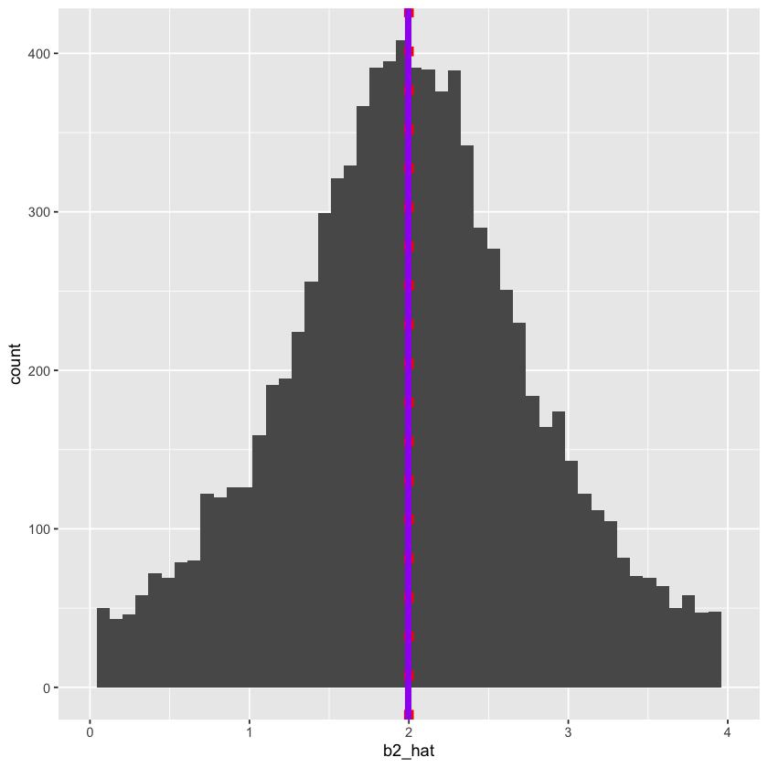
    


### Discussion

Mean of the estimates for for $b_2$ is 2.00. The variance of the all estimates is 4.15, and the mean of the variances of all estimates is 3.80. 95% of the estimates are above 0. The histigram is shown above. The line is the estimated mean, and the dashed line is the true mean.

# c


```R
n_c <- c(5, 10, 50, 100, 1000, 10000)
result_c <- lapply(n_c, function(n) create_results(n, n_simulations = 10000))
```


```R
#show all plots
lapply(result_c, function(x) x$plot)
```

    Warning message:
    “Removed 175 rows containing non-finite values (`stat_bin()`).”
    Warning message:
    “Removed 2 rows containing missing values (`geom_bar()`).”
    Warning message:
    “Removed 3 rows containing non-finite values (`stat_bin()`).”
    Warning message:
    “Removed 2 rows containing missing values (`geom_bar()`).”


    
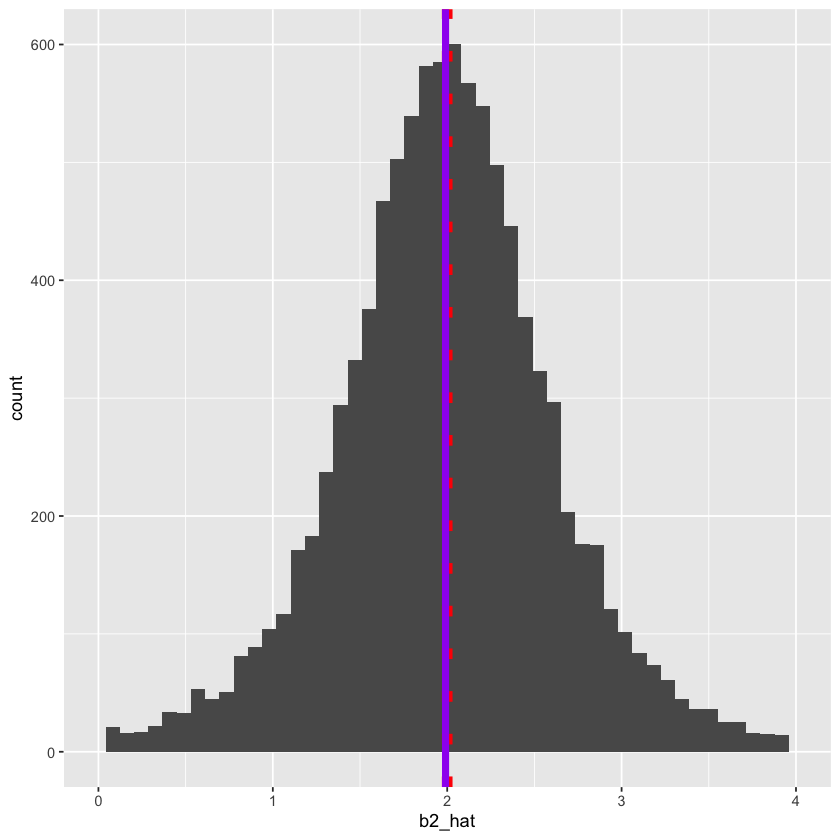
    


    Warning message:
    “Removed 2 rows containing missing values (`geom_bar()`).”


    
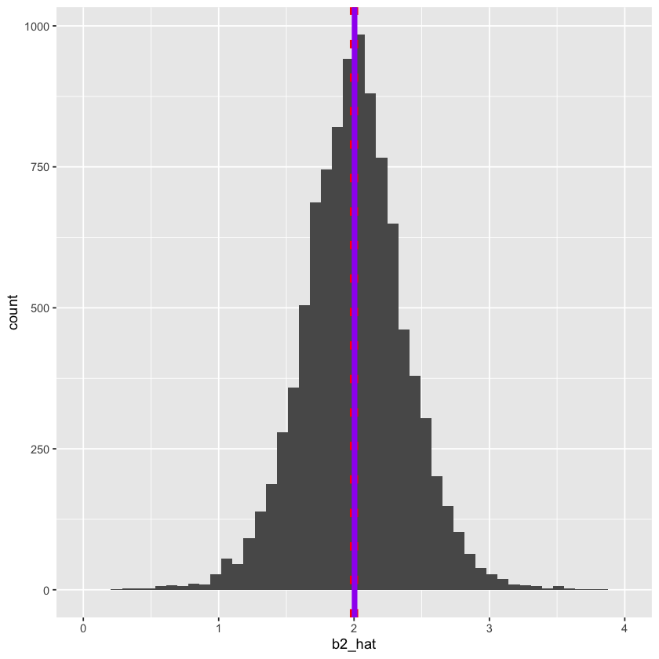
    


    Warning message:
    “Removed 2 rows containing missing values (`geom_bar()`).”


    
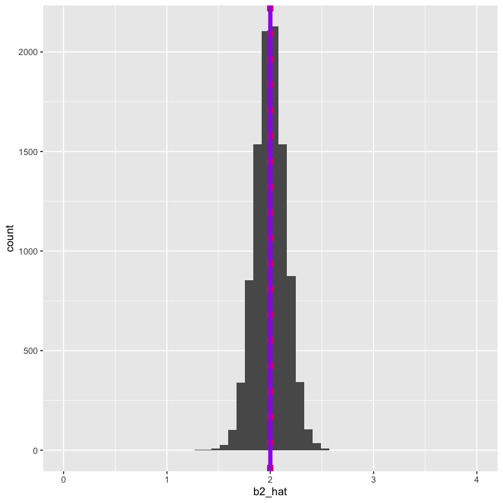
    


    Warning message:
    “Removed 2 rows containing missing values (`geom_bar()`).”


    
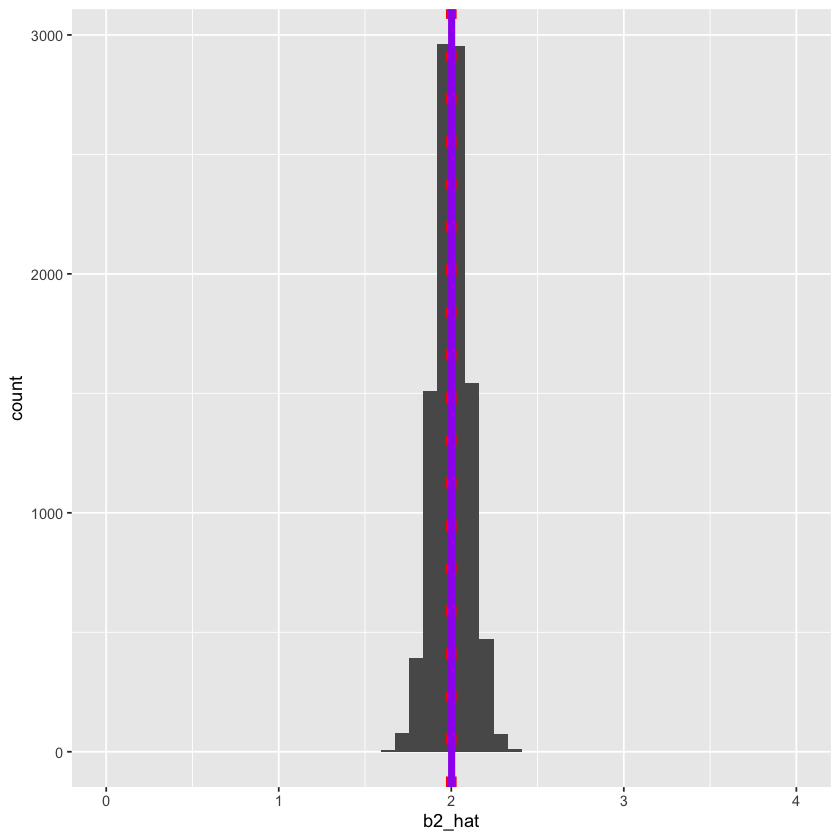
    


    Warning message:
    “Removed 2 rows containing missing values (`geom_bar()`).”


    [[1]]
    
    [[2]]
    
    [[3]]
    
    [[4]]
    
    [[5]]
    
    [[6]]


    
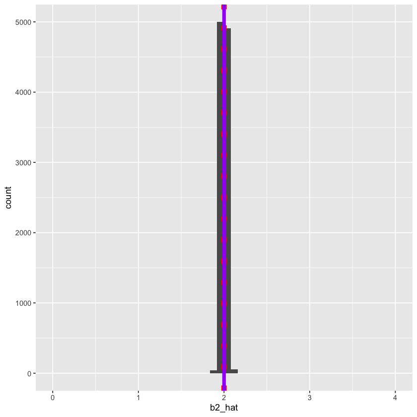
    


    
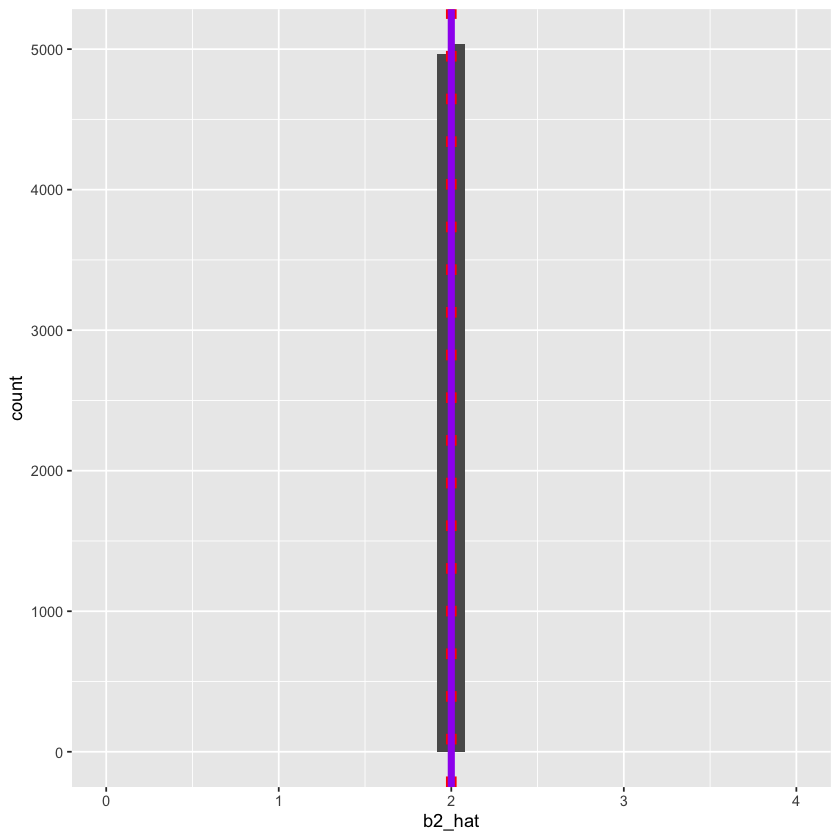
    


```R
hat_vars <- unlist(lapply(result_c, function(x) x$var_of_b2_hat))
hat_var_means <- unlist(lapply(result_c, function(x) x$b2_hat_var_mean))
var_compare <- data.table(n = n_c, hat_var = hat_vars, hat_var_mean = hat_var_means)
var_compare[, difference := abs(hat_var - hat_var_mean)]

var_compare

ggplot(data = var_compare, aes(x = n, y = difference)) +
    geom_point() +
    geom_line() +
    scale_x_log10()


```


<table class="dataframe">
<caption>A data.table: 6 × 4</caption>
<thead>
	<tr><th scope=col>n</th><th scope=col>hat_var</th><th scope=col>hat_var_mean</th><th scope=col>difference</th></tr>
	<tr><th scope=col>&lt;dbl&gt;</th><th scope=col>&lt;dbl&gt;</th><th scope=col>&lt;dbl&gt;</th><th scope=col>&lt;dbl&gt;</th></tr>
</thead>
<tbody>
	<tr><td>    5</td><td>5.232246e-01</td><td>0.4963706258</td><td>2.685402e-02</td></tr>
	<tr><td>   10</td><td>1.454925e-01</td><td>0.1443394325</td><td>1.153028e-03</td></tr>
	<tr><td>   50</td><td>2.203371e-02</td><td>0.0213224544</td><td>7.112554e-04</td></tr>
	<tr><td>  100</td><td>1.010299e-02</td><td>0.0103356636</td><td>2.326725e-04</td></tr>
	<tr><td> 1000</td><td>9.921028e-04</td><td>0.0010028528</td><td>1.075000e-05</td></tr>
	<tr><td>10000</td><td>9.798694e-05</td><td>0.0001000331</td><td>2.046170e-06</td></tr>
</tbody>
</table>


    
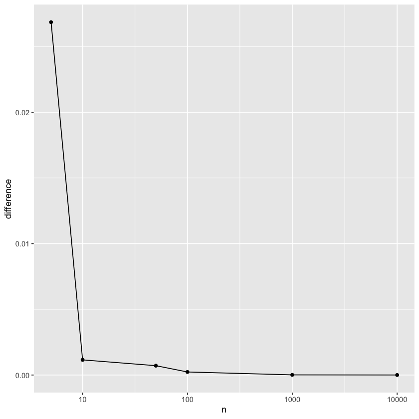
    


### Discussion

The graphs become thinner and thinner, meaning that the variance of the estimates is decreasing. The estimate variances become closer and closer to the actual variance of the estimates (the difference decreases). This is also shown in the figure above (note that this figure is in logarithmic scale). The concept of convergence in probability is quite relevant here. When we incerease N, this leads the estimated variance to converge to the actual variance, and the means are also quite close.

## d


```R
# do the t_test for each of 10000 simulations for b=2

t_tester <- function(b2_hat, b2_hat_var, b2 = 2) {
    t_value <- (b2_hat - b2) / sqrt(b2_hat_var)
}

create_results_d <- function(n, b1 = 1, b2 = 2, n_simulations) {
    results <- run_monte_carlo(n, b1, b2, n_simulations)

    b2_hat <- results$b2_hat
    b2_hat_var <- results$b2_hat_var

    b2_hat_mean <- mean(b2_hat)
    b2_hat_var_mean <- mean(b2_hat_var)

    b2_hat_var_var <- var(b2_hat_var)
    var_of_b2_hat <- var(b2_hat)

    t_values <- t_tester(b2_hat, b2_hat_var)
    critical_val <- qt(0.975, n - 2)

    # fraction b2_hat not equal to 2
    p_value <- mean(t_values > critical_val | t_values < -critical_val)
    
    return(list(
        b2_hat_mean = b2_hat_mean,
        b2_hat_var_mean = b2_hat_var_mean, 
        b2_hat_var = b2_hat_var,
        b2_hat_var_var = b2_hat_var_var,
        p_value = p_value
    ))
}

n_d <- c(10, 100, 1000, 10000)

result_d <- lapply(n_d, function(n) create_results_d(n, n_simulations = 10000))

```


```R
p_vals <- unlist(lapply(result_d, function(x) x$p_value))
data.table(n = n_d, p_value = p_vals)

```


<table class="dataframe">
<caption>A data.table: 4 × 2</caption>
<thead>
	<tr><th scope=col>n</th><th scope=col>p_value</th></tr>
	<tr><th scope=col>&lt;dbl&gt;</th><th scope=col>&lt;dbl&gt;</th></tr>
</thead>
<tbody>
	<tr><td>   10</td><td>0.0474</td></tr>
	<tr><td>  100</td><td>0.0519</td></tr>
	<tr><td> 1000</td><td>0.0492</td></tr>
	<tr><td>10000</td><td>0.0505</td></tr>
</tbody>
</table>


### Discussion

The fraction of the times we reject the hypothesis is generally around 0.05. This is what we would expect, as we draw samples from a normal distribution, and now testing with a critical value for 95% confidence interval. As we increase N, the number becomes more precisely near 0.05. This is due to fact that when we increase N, the dispersion of the estimates decreases, leading to lower number of cases where we have more extreme estimates. 

# d


```R
create_models_non_normal_error <- function(n, b1 = 1, b2 = 2) {
    e <- runif(n, 50, 100)
    x1 <- rep(1, n)
    x2 <- rnorm(n, 0, 1)
    x <- cbind(x1, x2)
    b <- as.matrix(c(b1, b2), ncol = 1, nrow = 2)
    y <- x %*% b + e

    lm_x_y <- lm(y ~ x2)
    # estimate of x2 coef
    b2_hat <- coef(lm_x_y)[2]
    # estimate of x2 coef variance
    b2_hat_var <- vcov(lm_x_y)[2, 2]

    return(list(b2_hat = b2_hat, b2_hat_var = b2_hat_var))
}

run_monte_carlo_non_normal_error <- function(n, b1 = 1, b2 = 2, n_simulations) {
    b2_hat <- vector("numeric", n_simulations)
    b2_hat_var <- vector("numeric", n_simulations)

    for (i in 1:n_simulations) {
        result <- create_models_non_normal_error(n, b1, b2)
        b2_hat[i] <- result$b2_hat
        b2_hat_var[i] <- result$b2_hat_var
    }

    return(list(b2_hat = b2_hat, b2_hat_var = b2_hat_var))
}

#repeat d with non-normal error
create_results_d_non_normal <- function(n, b1 = 1, b2 = 2, n_simulations) {
    results <- run_monte_carlo_non_normal_error(n, b1, b2, n_simulations)

    b2_hat <- results$b2_hat
    b2_hat_var <- results$b2_hat_var

    b2_hat_mean <- mean(b2_hat)
    b2_hat_var_mean <- mean(b2_hat_var)

    b2_hat_var_var <- var(b2_hat_var)
    var_of_b2_hat <- var(b2_hat)

    t_values <- t_tester(b2_hat, b2_hat_var)
    critical_val <- qt(0.975, n - 2)

    # fraction b2_hat not equal to 2
    p_value <- mean(t_values > critical_val | t_values < -critical_val)
    
    return(list(
        b2_hat_mean = b2_hat_mean,
        b2_hat_var_mean = b2_hat_var_mean, 
        var_of_b2_hat = var_of_b2_hat,
        b2_hat_var_var = b2_hat_var_var,
        p_value = p_value,
        t_values
    ))
}
n_d <- c(10, 100, 1000, 10000)

result_d_non_normal <- lapply(
    n_d,
    function(n) create_results_d_non_normal(n, n_simulations = 10000)
)
```


```R
p_vals_non_normal <- unlist(lapply(result_d_non_normal, function(x) x$p_value))
data.table(n = n_d, p_value = p_vals_non_normal)
```


<table class="dataframe">
<caption>A data.table: 4 × 2</caption>
<thead>
	<tr><th scope=col>n</th><th scope=col>p_value</th></tr>
	<tr><th scope=col>&lt;dbl&gt;</th><th scope=col>&lt;dbl&gt;</th></tr>
</thead>
<tbody>
	<tr><td>   10</td><td>0.0492</td></tr>
	<tr><td>  100</td><td>0.0480</td></tr>
	<tr><td> 1000</td><td>0.0522</td></tr>
	<tr><td>10000</td><td>0.0550</td></tr>
</tbody>
</table>


### Discussion

I used a uniform distribution between 50 and 100, and still got similar results. The main reason for this is the fact that despite not having a normal error term, the error term is independent of x. As a result, the fitted line will still be the best linear estimator, and the number of cases where we reject the hypothesis will be around 0.05.
